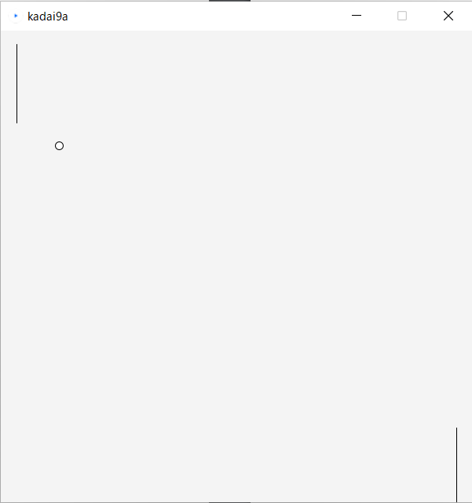
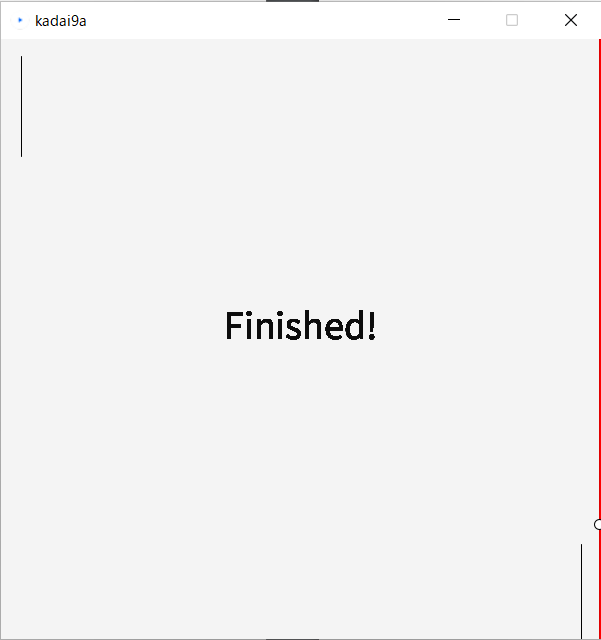
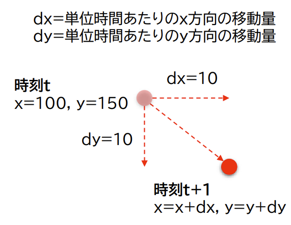
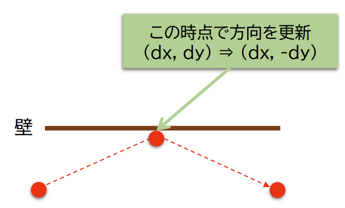

# Pong ゲームの作成

> いろいろと工夫する余地がありますが…まず「動くもの」を完成させる

## Pong ゲームとは

左右にある棒状のラケットを操作してボールを跳ね返し、自陣側の壁にヒットさせないようにするゲームです。ボールが壁にヒットした場合、ゲームが終了します。





### 操作方法

- 左側のラケット: マウスに追随して操作します。もしくはキーボードのWキー、Sキーで上下の操作をします。

- 右側のラケット: キーボードの↑ (上矢印) キー、↓ (下矢印) キーで上下の操作をします。

- 終了: Esc キーによって中断できます。

- 再開: Rキーによって試合終了時に再開できます。

## 実装

#### プログラム作成の段取り（抽象化）

巨視的にみるとプログラムは複雑 しかし..

- プログラムの一部分は（とても）単純な処理

- 良く使われる典型的な処理も多い

卓球ゲームを実現するための要素（部品）を考えてみよう

- ラケット

- ボール

- ラケットでボールを打つ

- ゲームの進行と終了

個々の要素を抽象化して単純に考える

- プログラム化が容易（むしろ単純化しないと実装できない）

- 対象を「こう実現することにしよう」という割り切りが重要

#### ラケットの動作の作成

⇒ 垂直に動く棒で（単純に）表す

- 一定の長さを持った直線か矩形で表す

- 見た目は`line()`や`rect()`で実現

上下に動かすにはどうするか？

⇒ 入力装置に連動して2方向に移動

- マウス側の操作
  ⇒ 変数`mouseX`あるいは`mouseY`の値を使って上下を操作

- キーボード側の操作
  ⇒ 変数`key`の値によって上下を操作

#### ボールの作成

ボールの特性を考える

- 一定速度で画面内を移動

- 上下の壁に当たったら跳ね返る

- 壁に当たったら（ボールのy軸がある範囲を超えたら），
  x方向の移動量をそのままにして，y方向の移動量の符号を反転

ボールをプログラム上でどう実現するか

- 現在の位置座標を変数で表す

- 現在の位置情報に基づいて円を描画（必要な大きさや塗りつぶ
  し）


ボールの動きをどう実現するか

- 次の時刻にどの方向に移動するかというベクトルを変数で表す

- 数値が単位時間あたりの移動量，方向は符号に相当

- ループ内でボールの位置座標を更新する



#### ボールとラケットの衝突判定

ボールの位置とラケットの位置を判定

- ラケットは点でなく上下に長さがあることに注意

- ラケットに当たった場合は2)と壁と同様に跳ね返る

- 跳ね返りあり⇒水平方向の向きを逆転（符号を反転）

- 上下の壁との衝突も同様に考える

- 跳ね返りあり⇒垂直方向の向きを逆転（符号を反転）




#### ゲームの開始と終了条件

- ゲーム開始： 任意に設定してよい
  
  - 画面中央から一定方向に移動して開始 など

- 終了条件： ボールが左端もしくは右端に到達
  
  - つまりラケットに当たらなかったら に相当
  
  - 上下の壁との衝突判定を参考にする

- ゲーム終了後の処理
  
  - ボールが右端に到達したら画面を赤くフラッシュ
  
  - ボールが左端に到達したら画面を青くフラッシュ
  
  - 簡易版では点数は考慮しない

## 実装 ヒント

型についての理解が大事です。int, float, boolean…。

#### ボール移動処理

```java
x += dx;
y += dy; 
```

#### ラケット移動処理

たとえば、`movePlayerRacketUp/Down`, `moveEnemyRacketUp/Down`というフラグ(キーが押され、racketが上下に動いているときにtrueになる)がtrueになっていて、ラケットが移動可能範囲にある場合に上下に操作でき
るようにする。

#### 横壁判定

`x + r >= width; x - r <= 0;`のようにして、右左の壁を判定し、終了処理を呼び出します。

#### 上下壁判定

`y - r < 0; y + r >= height;` のようにして、上下の壁を判定し、dy=-dy として跳ね返ります。

#### ラケット判定

条件は次のようになっています。

```java
((x - r <= racketCenterX && racketCenterX <= x + r)
&& (racketCenterY - racketSize <= y + r
&& y - r <= racketCenterY + racketSize));
```

条件のうち、`(x - r <= racketCenterX && racketCenterX <= x + r)` とは、ラケットの中心がボール内部に入ったときという条件であり、`(racketCenterY - racketSize <= y + r && y - r <= racketCenterY + racketSize)`とはボールの上下がラケットの内部にあるときという条件です。

## 引用

名古屋工業大学 情報工学科 2020年後期 コンピュータ入門(5605) 第9回
